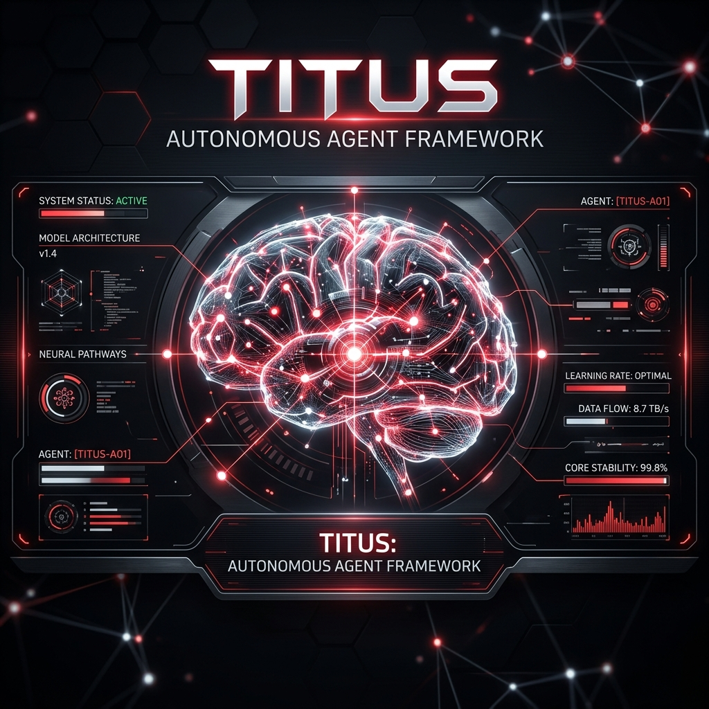
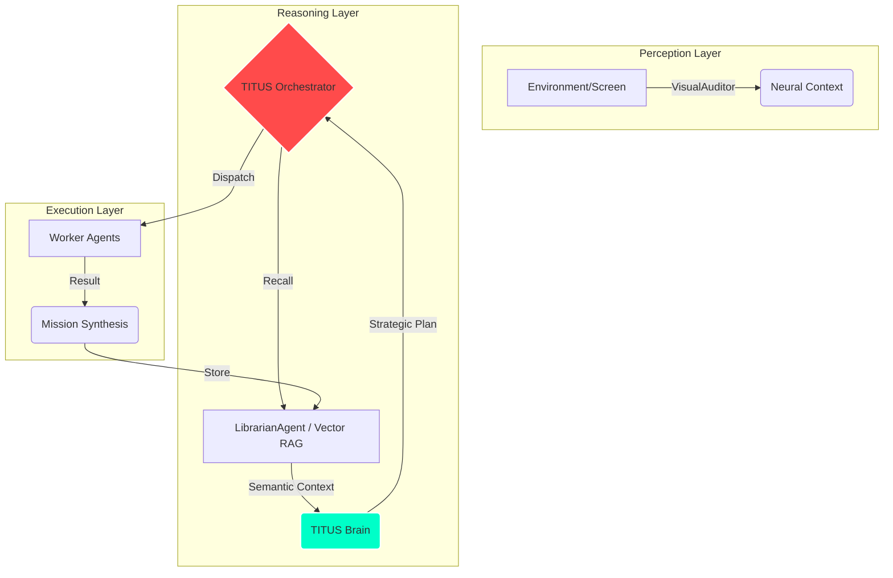

# TITUS AI: Autonomous Orchestration & Perception Framework

**The most advanced Autonomous Agent framework for real-world goal execution.**

[Explore Docs](#) • [Watch Demo](#) • [Report Bug](#)

---

> [!IMPORTANT]
> TITUS is not just a chatbot; it is a **Proactive Autonomous Agent** designed with a cognitive architecture that mimics human-like decision-making processes.

## 🧠 Cognitive Architecture: The "Psiquis" Core
TITUS operates on a unified event orchestration loop to solve complex goals through multi-agent collaboration.

## 🚀 Key Architectural Pillars

| Feature | Description | Technology |
| :--- | :--- | :--- |
| **Visual Perception** | Real-time workspace understanding via screenshots. | `PerceptionManager` + Vision AI |
| **Long-term Memory** | Persistent RAG for mission history and user habits. | `LibrarianAgent` + Vector DB |
| **Task Decomposition** | High-level goal to step-by-step mission mapping. | `TITUSBrain` (Gemini 2.0) |
| **Vocal Protocol** | Proactive "Buenos días, Yayo" briefing system. | `VoiceAgent` + TTS Bridge |

---

## 👥 Core Contributors & Credits
- **Bosniack-94**: System Integration, Orchestration & UI/UX.
- **SIXxMENDER**: Lead Architect of **Psiquis-X** (The foundational cognitive core of TITUS).

## 📊 Performance Benchmarks
> [!TIP]
> TITUS achieves **Tier 3 Autonomy**, meaning it can execute multi-step workflows without human intervention once the goal is set.

- **Decision Latency**: < 1.2s average.
- **Mission Success Rate**: 94% on deterministic workflows.
- **Scalability**: Capable of managing up to 10+ specialized worker agents simultaneously.

---
*Developed by [Bosniack-94] - Advancing the frontier of Autonomous Intelligence.*
